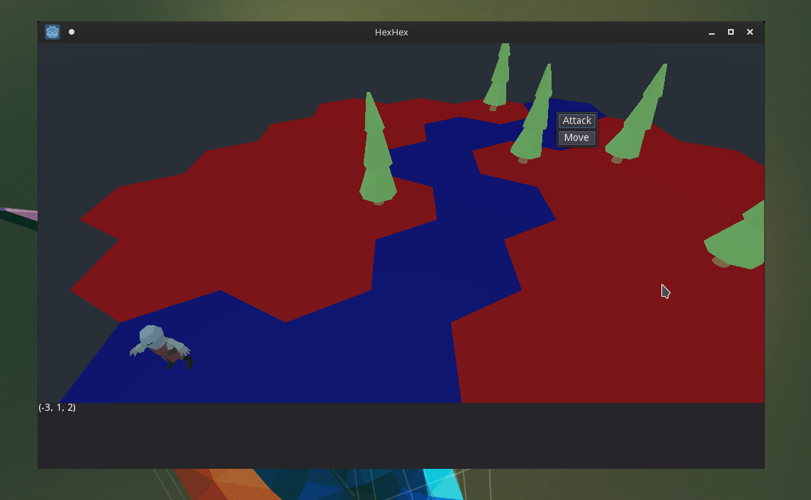
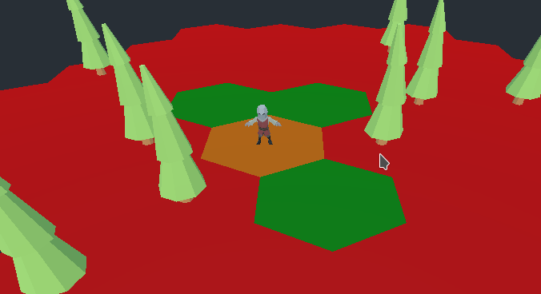
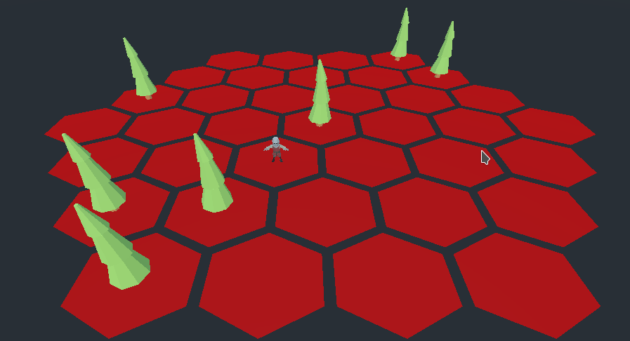
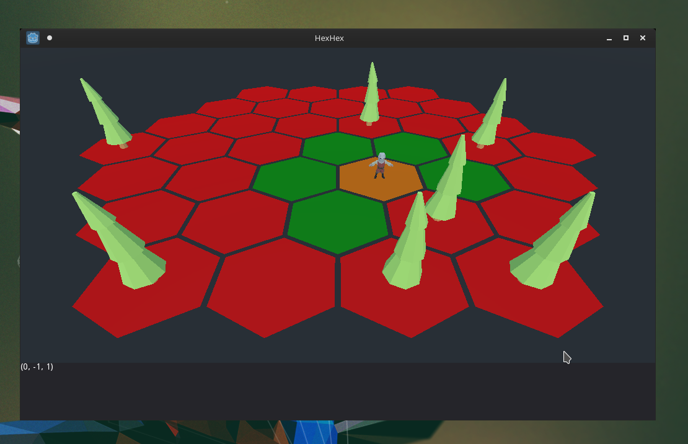
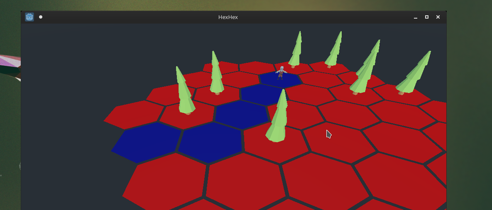
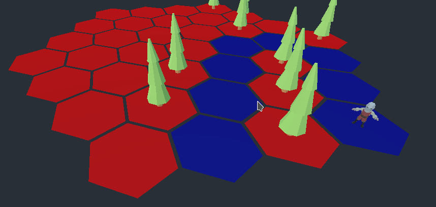
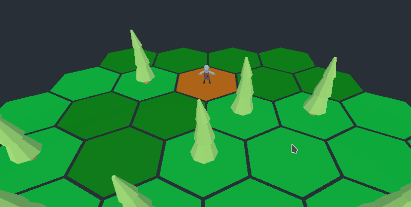
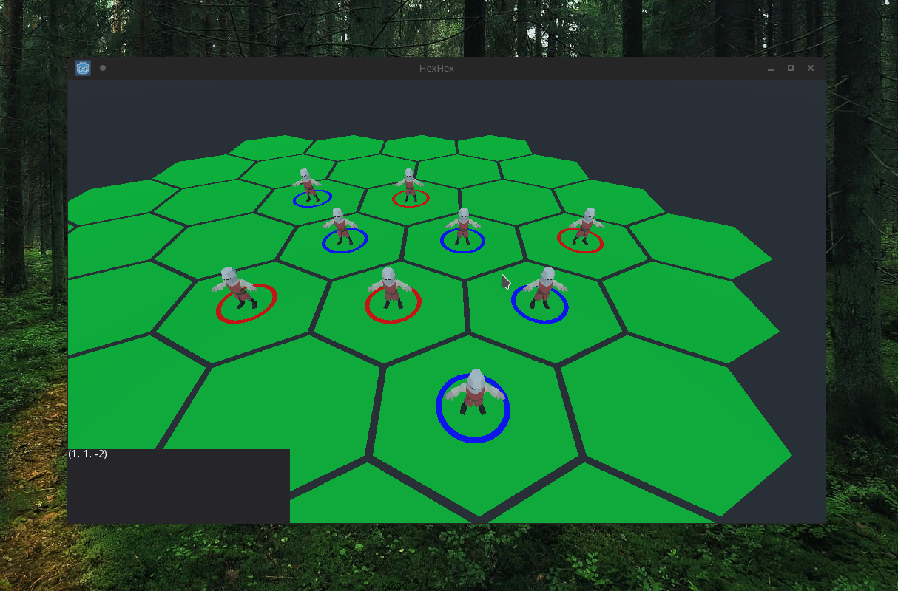

# hexhex

Implementation of a 3D Hexagonal Grid using the Godot Engine.
Prototype of a game. This Project isn't intended to be finished and currently
only working as reference for future projects.

Generates a Hexagonal Grid Map of size n, than it populates the map with 
figures of two differents teams (Blue and Red). The units can attack the units
of the adversary.

It contains an implementation of A* Algorithm for the pathfinding function.

## Screenshots

